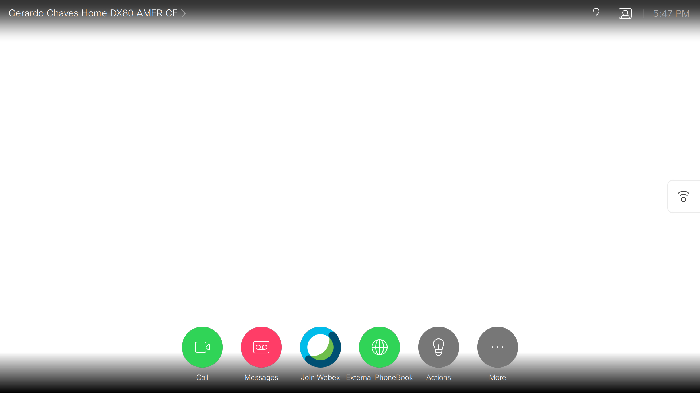
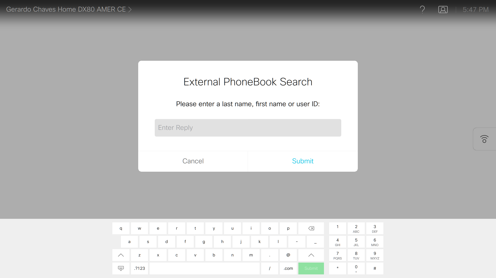
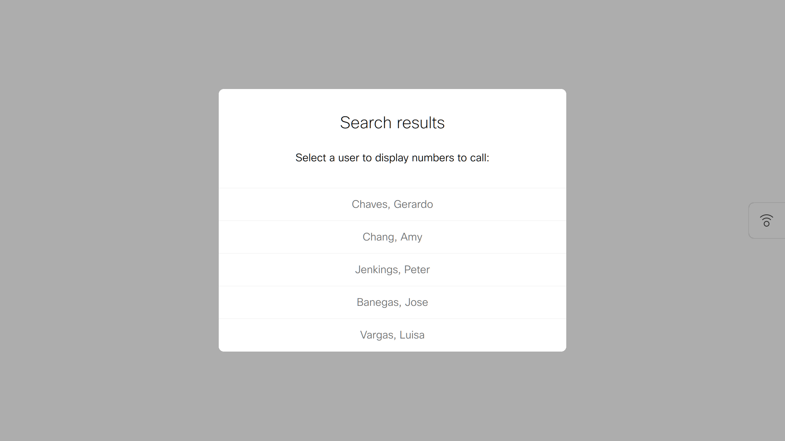
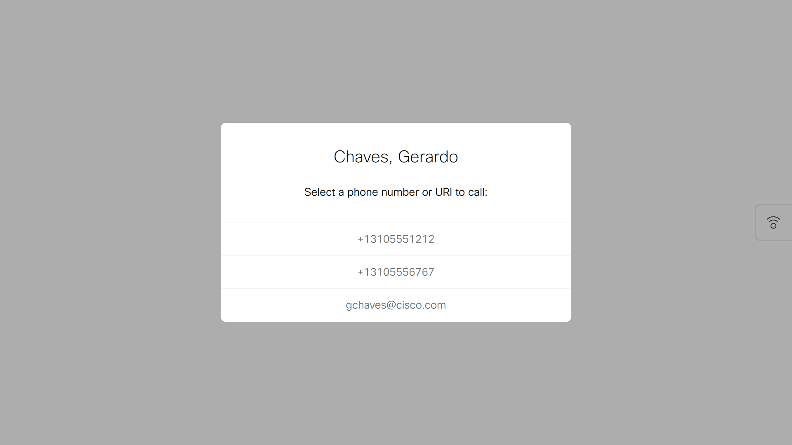

# Webex Room Device Custom External Address Book

Simple external address book for Webex Collaboration Room Devices

## Contacts
* Gerardo Chaves (gchaves@cisco.com)


## Solution Components
* Cisco Collaboration Room Devices
* Cisco Room Devices Rich API (xAPI)
* Python
* Flask
* SQLLite


## Usage

This demo implements a simple external address book for Webex Collaboration Room Devices.  
It does not integrate with the built-in phonebook mechanisms of the Room Devices, but rather provides  
a custom button for the touch 10 display and a macro that query an external server for phonebook entries




Upon pressing the External PhoneBook button, the macro displays a text input dialog to collect the search string
provided by the user:



The search string is used to access the server code (**flaskApp.py**) that searchs through a local SQLLite DB and returns
the search results (only 5 top entries at the moment):




Upon selecting one of the names that returned from the search, the macro code displays the destination (phone numbers, URIs) contained
in the directory entry to allow the user to select which one to dial:




The **flaskApp.py** contains the REST based phonebook server code.

Sample usage for testing server:
```
curl -i -H "Content-Type: application/json" -X POST -d '{"id":"5","first":"Barry","last":"Smith","email":"bsmith@acme.com","officephone":"+18185551212","mobilephone":"+18185554545"}' http://0.0.0.0:5001/new_contact

curl -i http://0.0.0.0:5001/contacts

curl -i -H "Content-Type: application/json" -X GET -d '{"last":"White","email","acme"}' http://0.0.0.0:5001/search

curl -i -H "Content-Type: application/json" -X POST -d '{"search_string":"smith"}' http://0.0.0.0:5001/searchall
```

## Configuration

1. Copy the contents of the **ExtPhonebookMacro.js** file into a macro you create on the Macro Editor from the Integration menu  
on the web interface of the Webex Collaboration Room Device you inted to run it on.

2. Change constants phBkServerHost and phBkServerPort in **ExtPhonebookMacro.js** to point to the location (IP Address and port) of the REST server being implemented by running **flaskApp.py** as per above.
   Example:
```
    const phBkServerHost='10.0.0.10';
    const phBkServerPort='5001';
```

3. The macro code clears the Webex Room Collaboration device's list of hosts allowed to reach via HTTPClient and adds the host specified above. If the device has an existing list of hosts to allow, comment out or remove the line that clears it:
   ``` xapi.command("HttpClient Allow Hostname Clear"); ```

4. Create an action button widget with id ext_phonebook using the UI Extensions configuration editor in the same Integration menu as above.
You can also just import this xml using the "Merge from file" option in the UI Extensions configuration page "hamburger" icon (upper right):

```
<Extensions>
  <Version>1.6</Version>
  <Panel>
    <PanelId>ext_phonebook</PanelId>
    <Type>Home</Type>
    <Icon>Language</Icon>
    <Order>1</Order>
    <Color>#30D557</Color>
    <Name>External PhoneBook</Name>
    <ActivityType>Custom</ActivityType>
  </Panel>
</Extensions>
```

5. Copy the **flaskApp.py** , **models.py** and **config.py** scripts to a server that has Python3 and the required dependencies installed.

6. Edit the **config.py** file if you wish to change the name of the local database file.  
   Default setting is:   SQLITE_DB_NAME = "addressbook.sqlite"
   


## Running The Code
1. Make sure Python 3 is installed
2. Make sure pip is installed (https://pip.pypa.io/en/stable/installing/ for more information on pip)
3. Enter 'pip install -r requirements.txt' into command line to download necessary libraries
4. Ensure all elements of the config.py file are completed
5. Initialize the SQLite DB file by running the **initalizeDatabase.py** script:
```python initializeDatabase.py```  
   This reads sample data exported from a TMS instance in a Cisco dCloud Collaboration Demo that is stored in the **PhonebookExportFile.txt** file 
   into the initial database. 
6. To run the flask application on the server, enter ‘python flaskApp.py’ in another terminal window
7. App will query setup table in DB. If values throw an API call error when using app, user will be prompted to check configuration and input correct values.
8. Make sure the code in **ExtPhonebookMacro.js** is installed and running on a Macro en the Webex Collaboration Room device you wish to use
9. Make sure an action button widget with ID ext_phonebook is created on the collaboration device as explained above.
10. Configure the IP address of the server where you installed the Flask application and the port it is listening on in the macro code.
11. Press the External Phonebook action button on the Touch 10 of the Webex Collaboration device to bring up the custom phonebook, enter a search term and then select an entry and number to dial


### LICENSE

Provided under Cisco Sample Code License, for details see [LICENSE](LICENSE.md)

### CODE_OF_CONDUCT

Our code of conduct is available [here](CODE_OF_CONDUCT.md)

### CONTRIBUTING

See our contributing guidelines [here](CONTRIBUTING.md)

#### DISCLAIMER:
<b>Please note:</b> This script is meant for demo purposes only. All tools/ scripts in this repo are released for use "AS IS" without any warranties of any kind, including, but not limited to their installation, use, or performance. Any use of these scripts and tools is at your own risk. There is no guarantee that they have been through thorough testing in a comparable environment and we are not responsible for any damage or data loss incurred with their use.
You are responsible for reviewing and testing any scripts you run thoroughly before use in any non-testing environment.